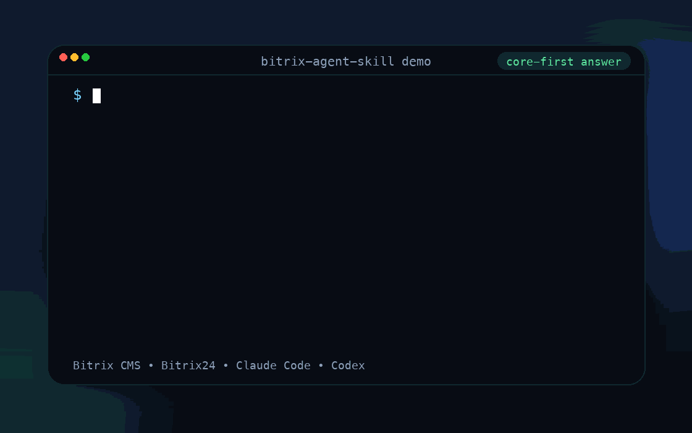

# Bitrix Agent Skill

[Latest release](https://github.com/Poliklot/bitrix-agent-skill/releases/latest) · [MIT License](LICENSE)

Core-first skill for `1C-Bitrix CMS` and `Bitrix24` in `Claude Code` and `Codex`.

`Bitrix Agent Skill` учит `Claude Code` и `Codex` работать с 1C-Bitrix core-first: агент сначала смотрит в реально установленное ядро, stock templates и wizard assets, а не сочиняет ответы по форумным обрывкам.

<p align="center">
  
</p>

- Поддерживает `D7` и legacy API в одном маршруте.
- Учитывает ситуации, когда в checkout вообще нет `www/local`.
- Ставит навык в `Claude Code` и `Codex` на macOS, Linux и Windows.
- При первом содержательном `/bitrix` должен предложить обновление, если release уже вырос.

Если навык сэкономил вам часы на Bitrix, поставьте репозиторию star.

## Быстрый старт / Quick Start

Обычная команда установки сама ставит навык во все найденные домашние контуры `Claude Code` и `Codex`.

### macOS / Linux

1. Установи последнюю release-версию навыка.

```bash
curl -fsSL https://raw.githubusercontent.com/Poliklot/bitrix-agent-skill/master/install.sh | bash
```

2. Разреши `Claude Code` запускать апдейтер без лишних запросов на разрешение.

```bash
bash ~/.claude/skills/bitrix/allow-update.sh
```

3. В любом проекте на Bitrix вызывай:

```bash
/bitrix <ваша задача>
```

### Windows (PowerShell)

1. Установи последнюю release-версию навыка.

```powershell
irm https://raw.githubusercontent.com/Poliklot/bitrix-agent-skill/master/install.ps1 | iex
```

2. Разреши `Claude Code` запускать апдейтер без лишних запросов на разрешение.

```powershell
powershell -ExecutionPolicy Bypass -File "$HOME\.claude\skills\bitrix\allow-update.ps1"
```

3. В любом проекте на Bitrix вызывай:

```text
/bitrix <ваша задача>
```

Если навык не появился сразу, перезапусти агент один раз.

<details>
<summary>Продвинутая установка: выбрать только Claude / только Codex / конкретную версию</summary>

### macOS / Linux

Установить навык только в нужный контур:

```bash
curl -fsSL https://raw.githubusercontent.com/Poliklot/bitrix-agent-skill/master/install.sh | bash -s -- --claude
curl -fsSL https://raw.githubusercontent.com/Poliklot/bitrix-agent-skill/master/install.sh | bash -s -- --codex
curl -fsSL https://raw.githubusercontent.com/Poliklot/bitrix-agent-skill/master/install.sh | bash -s -- --both
```

Установить конкретную release-версию:

```bash
curl -fsSL https://raw.githubusercontent.com/Poliklot/bitrix-agent-skill/master/install.sh | bash -s -- --version 1.5.0 --claude
```

### Windows (PowerShell)

Установить навык только в нужный контур:

```powershell
& ([scriptblock]::Create((irm https://raw.githubusercontent.com/Poliklot/bitrix-agent-skill/master/install.ps1))) -Claude
& ([scriptblock]::Create((irm https://raw.githubusercontent.com/Poliklot/bitrix-agent-skill/master/install.ps1))) -Codex
& ([scriptblock]::Create((irm https://raw.githubusercontent.com/Poliklot/bitrix-agent-skill/master/install.ps1))) -Both
```

Установить конкретную release-версию:

```powershell
& ([scriptblock]::Create((irm https://raw.githubusercontent.com/Poliklot/bitrix-agent-skill/master/install.ps1))) -Version 1.5.0 -Claude
```

</details>

## Чем он отличается

- **Core-first, а не forum-first.** Навык должен опираться на реально установленный Bitrix core и только потом на общие знания.
- **Не ломается без `www/local`.** Если project overrides отсутствуют, truth layer смещается в stock component templates и wizard public/template assets самого ядра.
- **Не притворяется магазинным экспертом без магазина.** `sale`, `catalog`, `bizproc`, `pull` и похожие контуры остаются `deferred`, пока модули реально не установлены.
- **Не тащит весь контекст сразу.** Агент идёт через progressive disclosure и читает только нужный reference-файл.

## Примеры задач / Examples

```text
/bitrix Найди в текущем core, как правильно работать с custom UF-типом и где там onBeforeSave
/bitrix Покажи stock template layer для form и объясни, что реально есть в intranet-варианте
/bitrix Разбери bitrix.sitecorporate в этом ядре и скажи, где wizard кладёт public и templates
/bitrix Проверь, есть ли в этом core sale/catalog и можно ли уже идти в магазинные задачи
```

## Проверено на живом core

Сейчас навык уже проверен и уверенно закрывает:

- ядро и инфраструктуру: ORM, модули, события, кеш, DB layer, session/auth, RBAC, update stepper
- контентные и системные модули: инфоблоки, HL-блоки, формы, блог, форум, голосования, photogallery, landing, fileman, translate, search, SEO, import/export
- интеграционный и эксплуатационный слой: REST, socialservices, b24connector, mobileapp, clouds, bitrixcloud, messageservice, perfmon, admin UI, migrations

Магазинный контур остаётся отдельным этапом и подключается только после установки соответствующего core.

<details>
<summary>Полная матрица reference-файлов и тем</summary>

| Файл справки | Темы |
|--------------|------|
| `orm.md` | DataManager, CRUD, связи, фильтры, агрегация, runtime fields, ORM events, Result/Error |
| `events-routing.md` | EventManager, Engine\Controller, AJAX, роутинг, CSRF |
| `modules-loader.md` | Структура модуля, Loader, PSR-4, Application, ServiceLocator, Config\Option, Loc |
| `components.md` | CBitrixComponent, шаблоны, кеш компонента, CComponentEngine |
| `sitecorporate.md` | `bitrix.sitecorporate`: wizard shell, `corp_services`/`corp_furniture`, `wizard_solution`, panel rerun, stock `furniture.*`, wizard `site/public` и `site/templates`, conditional `catalog` dependency в `corp_furniture` skeleton |
| `cache-infra.md` | Data\Cache, TaggedCache, CAgent, IO\File/Directory/Path |
| `clouds.md` | Clouds: bucket-ы, external file storage, file hooks, resize/src/makeFileArray, upload queues, failover |
| `bitrixcloud.md` | Bitrix Cloud: backup quota/files/jobs, monitoring, policy webservice, local option storage, mobile inspector, backup buckets |
| `fileman.md` | Fileman: HTML editor, address/geo userfields, map/video property types, PDF/player/map компоненты |
| `http.md` | Type\DateTime, HttpClient, HttpRequest, HttpResponse |
| `iblocks.md` | Инфоблоки legacy + D7 ORM, свойства, HL-блоки, события инфоблоков |
| `highloadblock.md` | Highloadblock: CRUD, compileEntity, dynamic DataManager, права, `highloadblock.*` компоненты, UI EntitySelector |
| `photogallery.md` | Галереи, альбомы, `USER_ALIAS`, section-UF, upload/watermark, `REAL_PICTURE`, slideshow, photo comments |
| `mobileapp.md` | MobileApp: admin mobile, JN/native components/extensions, designer apps, push settings, token registration, `/mobileapp/jn/*` |
| `b24connector.md` | Bitrix24 connector: connect/disconnect, widgets, openlines/chat/recall/forms, per-site restrictions, public script injection |
| `iblock-hl-relations.md` | Связи инфоблоков и HL: directory (UF_XML_ID), HL-поля в UF, `_REF` в ORM, AbstractOrmRepository |
| `custom-uf-types.md` | Кастомные UF-типы (BaseType, onBeforeSave, загрузка файлов), ACF-подходы через HL (Repeater, Group, Flexible Content, глубокая вложенность) |
| `forum.md` | Форумы: CForumNew, CForumTopic, CForumMessage, права, подписки, стандартные `forum.*` компоненты |
| `vote.md` | Опросы и голосования: CVote, CVoteChannel, CVoteQuestion, CVoteAnswer, `voting.*` компоненты |
| `landing.md` | Лендинги: Site, Landing, Block, Hook, Rights, public URL, `landing.*` компоненты |
| `location.md` | Геолокации и адреса: LocationService, AddressService, FormatService, location controllers, location ORM |
| `socialservices.md` | Соц-авторизация: CSocServAuthManager, провайдеры OAuth, UserLinkTable, AuthFlow, `socserv.*` компоненты |
| `messageservice.md` | MessageService: SMS-провайдеры, Message, SmsManager, ограничения, REST, callback-и, config components |
| `translate.md` | Translate: lang-файлы, индекс фраз, translate UI, CSV import/export, translate:index, права и panel hooks |
| `perfmon.md` | Perfmon: SQL/hit/cache diagnostics, схема, индексы, admin-страницы производительности |
| `sale.md` | Интернет-магазин [deferred]: только при установленном модуле `sale` |
| `catalog.md` | Торговый каталог [deferred]: только при установленном модуле `catalog` |
| `commerce-workflows.md` | Магазинные workflow [deferred]: только после установки магазинного core |
| `blog-socialnet.md` | Блог текущего core: `CBlog*`, D7 read-only таблицы `PostTable`/`CommentTable`, mail reply handlers, search reindex, stock template variants (`micro`, `old_version`, `socialnetwork`), conditional `socialnet` contour |
| `push-pull.md` | Push&Pull [deferred]: только при установленном модуле `pull` |
| `workflow.md` | Бизнес-процессы [deferred]: только при установленном модуле `bizproc` |
| `subscribe.md` | Рассылки: CRubric, CSubscription, CPosting, CPostingTemplate, подписки и выпуски |
| `security.md` | AppSec + модуль `security`: WAF, redirect/IP rules, session hardening, OTP/MFA, recovery codes, antivirus, site checker, xscan |
| `rest.md` | REST-методы, OnRestServiceBuildDescription, REST-события, Webhook, OAuth |
| `admin-ui.md` | Админ-страницы, CAdminList, CAdminForm, CAdminTabControl, кастомные UF-типы в админке |
| `entities-migrations.md` | Создание инфоблоков/типов/свойств, групп, пользователей, прав доступа, SQL-миграции |
| `sef-urls.md` | ЧПУ (SEF), urlrewrite.php, UrlRewriter D7, SEF_MODE/SEF_RULE, CComponentEngine |
| `seo-cache-access.md` | Очистка кеша, noindex, sitemap, robots.txt, canonical, OpenGraph, JSON-LD schema.org |
| `mail-notifications.md` | CEventType, CEventMessage, Mail\Event::send, SMS-провайдеры |
| `users.md` | UserTable D7, CUser::Add/Login/Update, группы пользователей, UF-поля, восстановление пароля |
| `templates.md` | Структура шаблона сайта, Asset D7, $APPLICATION в header/footer, композитный кеш |
| `webforms.md` | `form` в реальном core: формы, результаты, статусы, handlers, validators, CRM link, secure file access, stock component/template layer и `intranet` variants |
| `search.md` | CSearch::Index/DeleteIndex/ReIndexAll, CSearchTitle, BeforeIndex, OnSearch, OnSearchGetURL, быстрый AJAX-поиск |
| `import-export.md` | Импорт CSV/URL, многошаговый импорт, CFile::SaveFile/MakeFileArray/ResizeImageGet, потоковый экспорт |
| `grid-admin-modern.md` | Современный Grid UI: Grid, Settings, Options, ComponentParams, processRequest, getOrmFilter, bitrix:main.ui.grid |
| `update-stepper.md` | Stepper (итеративные обновления), bindClass, CLI команды (`update:*`, `make:*`, `orm:annotate`, `messenger:consume-messages`) |
| `validation.md` | ValidationService, PHP 8 Attributes (#[NotEmpty], #[Email], #[Length], #[Min], #[Max] и др.) |
| `session-auth.md` | Session (ArrayAccess, enableLazyStart, isActive), KernelSession, CompositeSessionManager, SessionConfigurationResolver |
| `database-layer.md` | DB\Connection, SqlHelper (quote, forSql, getCurrentDateTimeFunction), различия MySQL/PgSQL/Oracle/MSSQL |
| `access-rbac.md` | Access\Permission\PermissionDictionary, RoleDictionary, BaseAccessController, Rule, RBAC |
| `file-upload-modern.md` | FileUploader\FieldFileUploaderController, UploaderController, Configuration, UploadedFilesRegistry |
| `numerator.md` | Numerator, NumberGeneratorFactory, NumeratorTable, шаблоны нумерации документов |
| `userconsent.md` | UserConsent\Consent::addByContext, Agreement, DataProvider, GDPR-согласие |

</details>

## Как это работает

Навык следует формату progressive disclosure от [agentskills.io](https://agentskills.io):

- **`bitrix/SKILL.md`** — точка входа: core-first правила, рабочий алгоритм, подтверждение перед изменением данных, маршрутизация по темам
- **`bitrix/references/*.md`** — тематические файлы, загружаются по необходимости, когда задача требует конкретной темы

Агент читает только релевантный reference-файл, а не весь контекст сразу.

<details>
<summary>Обновление, версии и удаление</summary>

### Обновление

#### macOS / Linux

```bash
bash ~/.claude/skills/bitrix/update.sh
bash ~/.claude/skills/bitrix/update.sh --force
bash ~/.claude/skills/bitrix/update.sh --check
bash ~/.claude/skills/bitrix/update.sh --version 1.5.0

bash "${CODEX_HOME:-$HOME/.codex}/skills/bitrix/update.sh"
bash "${CODEX_HOME:-$HOME/.codex}/skills/bitrix/update.sh" --force
bash "${CODEX_HOME:-$HOME/.codex}/skills/bitrix/update.sh" --check
bash "${CODEX_HOME:-$HOME/.codex}/skills/bitrix/update.sh" --version 1.5.0
```

#### Windows (PowerShell)

```powershell
powershell -ExecutionPolicy Bypass -File "$HOME\.claude\skills\bitrix\update.ps1"
powershell -ExecutionPolicy Bypass -File "$HOME\.claude\skills\bitrix\update.ps1" -Force
powershell -ExecutionPolicy Bypass -File "$HOME\.claude\skills\bitrix\update.ps1" -Check
powershell -ExecutionPolicy Bypass -File "$HOME\.claude\skills\bitrix\update.ps1" -Version 1.5.0

$CodexHome = if ($env:CODEX_HOME) { $env:CODEX_HOME } else { Join-Path $HOME '.codex' }
powershell -ExecutionPolicy Bypass -File (Join-Path (Join-Path $CodexHome 'skills') 'bitrix\update.ps1')
powershell -ExecutionPolicy Bypass -File (Join-Path (Join-Path $CodexHome 'skills') 'bitrix\update.ps1') -Force
powershell -ExecutionPolicy Bypass -File (Join-Path (Join-Path $CodexHome 'skills') 'bitrix\update.ps1') -Check
powershell -ExecutionPolicy Bypass -File (Join-Path (Join-Path $CodexHome 'skills') 'bitrix\update.ps1') -Version 1.5.0
```

Начиная с версии `1.3.7`, при первом содержательном обращении к `/bitrix` навык должен сначала проверить release и, если версия выросла, предложить обновление в явной форме: `Обновилась версия скилла с X до Y. Давай обновим?`

### Версии

#### macOS / Linux

```bash
bash ~/.claude/skills/bitrix/versions.sh
bash "${CODEX_HOME:-$HOME/.codex}/skills/bitrix/versions.sh"
```

#### Windows (PowerShell)

```powershell
powershell -ExecutionPolicy Bypass -File "$HOME\.claude\skills\bitrix\versions.ps1"

$CodexHome = if ($env:CODEX_HOME) { $env:CODEX_HOME } else { Join-Path $HOME '.codex' }
powershell -ExecutionPolicy Bypass -File (Join-Path (Join-Path $CodexHome 'skills') 'bitrix\versions.ps1')
```

### Удаление

#### macOS / Linux

```bash
bash ~/.claude/skills/bitrix/uninstall.sh
bash "${CODEX_HOME:-$HOME/.codex}/skills/bitrix/uninstall.sh"
```

#### Windows (PowerShell)

```powershell
powershell -ExecutionPolicy Bypass -File "$HOME\.claude\skills\bitrix\uninstall.ps1"

$CodexHome = if ($env:CODEX_HOME) { $env:CODEX_HOME } else { Join-Path $HOME '.codex' }
powershell -ExecutionPolicy Bypass -File (Join-Path (Join-Path $CodexHome 'skills') 'bitrix\uninstall.ps1')
```

</details>

## Требования

- Claude Code или Codex
- 1C-Bitrix CMS 23+

## Обратная связь / Feedback

- Issue-ы и PR приветствуются, особенно если вы принесли новый core-first кейс из реального проекта.
- Если навык помог, поставьте star: это лучший сигнал, что такой Bitrix-first подход действительно нужен.

## Лицензия

MIT. Подробности в [LICENSE](LICENSE).
